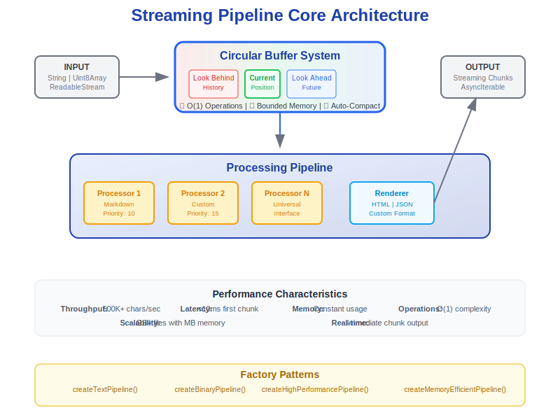
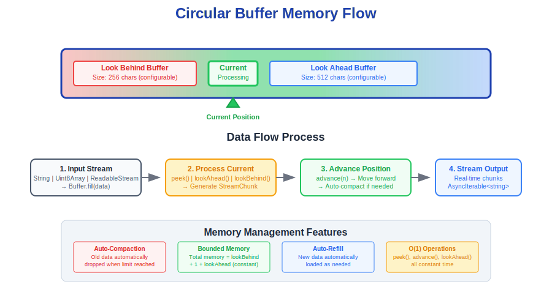

# Architecture Guide

Deep dive into the circular buffer streaming architecture and design decisions.

## Overview

The Streaming Pipeline Core is built around a **circular buffer system** that provides bounded memory usage with unlimited streaming capability. This architecture enables real-time processing of large content while maintaining constant memory usage.

## Architecture Diagrams

### System Overview



The above diagram shows the complete system architecture with input layer, circular buffer system, processing pipeline, and output layer.

### Buffer Memory Flow



This diagram illustrates how data flows through the circular buffer system and the memory management features.

## Circular Buffer Architecture

### Core Concept

```
┌─────────────────────────────────────────────────────────┐
│                 Circular Buffer                        │
│  ┌─────────────┬──────────┬──────────────────────────┐ │
│  │ LookBehind  │ Current  │      LookAhead           │ │
│  │   History   │ Position │       Future             │ │
│  │             │    ↑     │                          │ │
│  └─────────────┴──────────┴──────────────────────────┘ │
│                                                         │
│  Auto-compact ←          → Auto-refill                  │
└─────────────────────────────────────────────────────────┘
```

### Memory Management

#### Bounded Memory Usage
- **Fixed Size**: Buffer size = `lookBehindSize + 1 + lookAheadSize`
- **Automatic Compaction**: Old lookBehind data automatically dropped
- **Constant Usage**: Memory never grows regardless of input size
- **No Leaks**: Automatic cleanup prevents accumulation

#### Example Memory Footprint
```typescript
// Small buffer: ~193 bytes
const small = new CircularStreamBuffer(64, 128);  
// 64 + 1 + 128 = 193 bytes

// Large buffer: ~6145 bytes  
const large = new CircularStreamBuffer(2048, 4096);
// 2048 + 1 + 4096 = 6145 bytes

// Even for infinite streams: memory stays constant!
```

### Performance Characteristics

#### O(1) Operations
All buffer operations are constant time:
- **peek()**: O(1) - direct array access
- **advance()**: O(1) - increment with modulo
- **lookAhead()**: O(1) - copy slice of fixed size
- **lookBehind()**: O(1) - copy slice of fixed size
- **fill()**: O(k) where k = data size (not buffer size)

#### No Data Copying
- **Circular wrapping**: No shifting or copying when buffer wraps
- **In-place updates**: Data written directly to buffer positions
- **Zero-copy operations**: Lookahead/lookbehind return views, not copies

## System Components

### 1. Buffer Layer

#### CircularStreamBuffer (Base)
```typescript
class CircularStreamBuffer {
  private buffer: Uint8Array        // Fixed-size circular buffer
  private head: number = 0          // Write position
  private tail: number = 0          // Read start position
  private current: number = 0       // Current processing position
  private globalPos: number = 0     // Absolute stream position
}
```

**Responsibilities:**
- Raw byte storage and management
- Circular buffer mechanics
- Position tracking and bounds checking
- Auto-compaction when limits exceeded

#### TextCircularBuffer (Text Extension)
```typescript
class TextCircularBuffer extends CircularStreamBuffer {
  private decoder: TextDecoder      // UTF-8 string decoding
}
```

**Responsibilities:**
- Text encoding/decoding
- String-based lookahead/lookbehind
- Character position tracking
- UTF-8 boundary handling

### 2. Processing Layer

#### StreamingPipeline (Orchestrator)
```typescript
class StreamingPipeline {
  private processors: IStreamProcessor[]     // Ordered by priority
  private renderers: Map<string, IStreamRenderer>
  private bufferOptions: BufferOptions       // Buffer configuration
}
```

**Responsibilities:**
- Buffer creation and configuration
- Processor coordination and priority ordering
- Auto-refill management
- Error handling and recovery

#### IStreamProcessor (Universal Interface)
```typescript
interface IStreamProcessor {
  canProcess(context: StreamingContext): boolean
  process(context: StreamingContext): {
    chunks: StreamChunk[]
    advance: number
  }
}
```

**Responsibilities:**
- Pattern recognition at current position
- Chunk generation from matched patterns
- Position advancement calculation
- State management (optional)

### 3. Factory Layer

#### PipelineFactory (Configuration)
```typescript
class PipelineFactory {
  static createTextPipeline(options?: BufferConfig): StreamingPipeline
  static createBinaryPipeline(options?: BufferConfig): StreamingPipeline
  static createHighPerformancePipeline(): StreamingPipeline
}
```

**Responsibilities:**
- Pre-configured pipeline creation
- Optimized buffer size selection
- Common use case templates

## Processing Flow

### 1. Initialization Phase

```
Input Analysis → Buffer Creation → Processor Registration → Renderer Registration
```

1. **Input Analysis**: Determine if string, Uint8Array, or ReadableStream
2. **Buffer Creation**: Select appropriate buffer type and size
3. **Component Registration**: Add processors and renderers to pipeline
4. **Configuration**: Apply buffer options and settings

### 2. Streaming Phase

```
Fill Buffer → Find Processor → Process Position → Generate Chunks → 
Render Output → Advance Position → Check Refill → Repeat
```

#### Detailed Flow:
```typescript
while (!buffer.isEOF || buffer.canAdvance()) {
  // 1. Check if buffer needs refill
  if (buffer.needsRefill() && autoRefill) {
    await fillBuffer(buffer, input);
  }
  
  // 2. Create processing context
  const context = createContext(buffer, encoding, options);
  
  // 3. Find appropriate processor
  const processor = findProcessor(context);
  
  // 4. Process current position
  if (processor) {
    const result = processor.process(context);
    
    // 5. Render chunks immediately
    for (const chunk of result.chunks) {
      yield renderer.renderChunk(chunk);
    }
    
    // 6. Advance buffer position
    for (let i = 0; i < result.advance; i++) {
      buffer.advance();
    }
  } else {
    // 7. No processor found, advance one position
    buffer.advance();
  }
}
```

### 3. Cleanup Phase

```
Mark EOF → Process Remaining → Emit Final Chunks → Reset State
```

## Design Patterns

### 1. Strategy Pattern (Processors)
- **Intent**: Pluggable processing algorithms
- **Implementation**: IStreamProcessor interface with canProcess() and process()
- **Benefit**: Easy to add new content types without modifying pipeline

### 2. Factory Pattern (Pipeline Creation)
- **Intent**: Encapsulate complex object creation
- **Implementation**: PipelineFactory with pre-configured methods
- **Benefit**: Simplified setup for common use cases

### 3. Template Method (Base Classes)
- **Intent**: Define algorithm skeleton with customizable steps
- **Implementation**: BaseStreamProcessor with helper methods
- **Benefit**: Consistent processor behavior with customization points

### 4. Observer Pattern (Events)
- **Intent**: Decouple processing from monitoring
- **Implementation**: Event emission during processing lifecycle
- **Benefit**: Extensible monitoring without core changes

## Memory Architecture

### Buffer Allocation Strategy

#### Small Buffers (< 1KB)
```typescript
// Optimized for simple patterns
lookBehindSize: 64,    // Minimal context
lookAheadSize: 128     // Basic pattern matching
```
- **Use Case**: Simple text processing, real-time editors
- **Memory**: ~200 bytes
- **Performance**: Maximum speed, minimal latency

#### Medium Buffers (1-4KB)
```typescript
// Balanced context and performance
lookBehindSize: 256,   // Good context
lookAheadSize: 1024    // Complex patterns
```
- **Use Case**: Markdown processing, code parsing
- **Memory**: ~1.3KB
- **Performance**: Good balance of speed and capability

#### Large Buffers (4-8KB)
```typescript
// Rich context for complex parsing
lookBehindSize: 1024,  // Rich history
lookAheadSize: 4096    // Very complex patterns
```
- **Use Case**: Document processing, protocol parsing
- **Memory**: ~5KB
- **Performance**: Maximum parsing capability

### Auto-Compaction Algorithm

```typescript
private autoCompact(): void {
  const behindDistance = this.getAvailableBehind();
  if (behindDistance > this.maxLookBehind) {
    const excess = behindDistance - this.maxLookBehind;
    this.tail = (this.tail + excess) % this.buffer.length;
    this.filled -= excess;
  }
}
```

**Triggers:**
- After each advance() operation
- When lookBehind exceeds configured limit
- During buffer refill operations

**Benefits:**
- Maintains bounded memory usage
- Prevents buffer overflow
- Automatic cleanup without manual intervention

## Error Handling

### Buffer Boundary Protection

```typescript
// Safe advance with boundary checking
advance(): boolean {
  if (!this.canAdvance()) return false;
  
  this.current = (this.current + 1) % this.buffer.length;
  this.globalPos++;
  this.autoCompact();
  
  return true;
}
```

### Infinite Loop Prevention

```typescript
// Guaranteed progress in pipeline
const safeAdvance = Math.max(1, result.advance);
for (let i = 0; i < safeAdvance; i++) {
  if (!buffer.advance()) break;
}
```

### Graceful Degradation

```typescript
// Continue processing after errors
try {
  const result = processor.process(context);
  // Process result...
} catch (error) {
  this.logger.error('Processing error', { error: error.message });
  // Continue with next position
  if (!buffer.advance()) break;
}
```

## Performance Optimizations

### 1. Lazy Buffer Allocation
- Buffers created only when needed
- Size optimization based on input type
- Memory pooling for frequent allocations

### 2. Efficient String Operations
- UTF-8 decoder reuse
- Minimal string allocation
- Direct buffer access when possible

### 3. Processor Priority Ordering
- High-priority processors checked first
- Early termination on match
- Minimal processor evaluation overhead

### 4. Streaming Refill Strategy
- Refill only when needed (buffer < 50% full)
- Asynchronous refill during processing
- Backpressure handling for slow sources

## Scalability Characteristics

### Horizontal Scaling
- **Multiple Pipelines**: Independent processing streams
- **Concurrent Processing**: No shared state between pipelines
- **Resource Isolation**: Each pipeline has bounded memory

### Vertical Scaling
- **Configurable Buffers**: Adjust memory vs. capability trade-offs
- **Processor Optimization**: Add specialized processors for performance
- **Batch Processing**: Process multiple chunks per iteration

### Stream Size Independence
- **Constant Memory**: Same memory usage for 1KB or 1GB inputs
- **Linear Time**: Processing time scales with content size, not buffer size
- **Infinite Streams**: Can process unlimited length streams

## Integration Patterns

### ReadableStream Integration
```typescript
const pipeline = PipelineFactory.createTextPipeline();

// Handle streaming input
const stream = new ReadableStream({...});
for await (const output of pipeline.processStream(stream, 'html')) {
  // Process real-time output
}
```

### File Processing
```typescript
// Large file processing with bounded memory
const fileStream = fs.createReadStream('huge-file.md');
const pipeline = PipelineFactory.createHighPerformancePipeline();

for await (const html of pipeline.processStream(fileStream, 'html')) {
  // Constant memory usage regardless of file size
}
```

### Network Streaming
```typescript
// Process network data as it arrives
const response = await fetch('/streaming-data');
const pipeline = PipelineFactory.createTextPipeline();

for await (const processed of pipeline.processStream(response.body, 'json')) {
  // Real-time processing of network stream
}
```

This architecture provides the foundation for efficient, scalable, and memory-bounded streaming processing suitable for production environments.